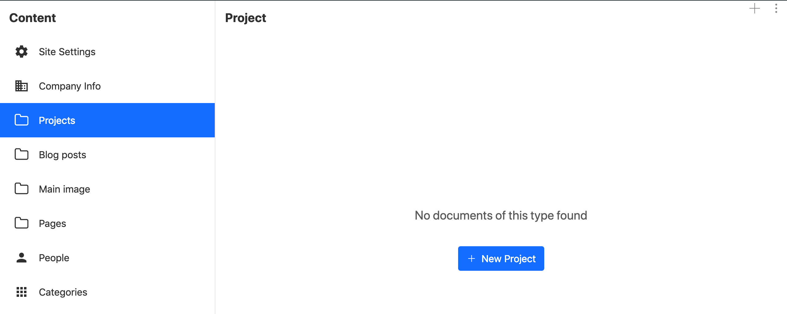

JAMStack is a new buzzword in the web-world, and I'm am trying to demystify it. So I've created [a blog](https://www.alicevidjeskog.com) and I'm proud of it *(for a while atleast)*!

I have to say that setting everything running was very easy. I followed [this](https://www.sanity.io/blog/how-to-quickly-set-up-a-gatsby-js-jamstack-website-with-a-headless-cms) tutorial written by a Sanity employee. The tutorial explains each step in detail and I had no problems in getting everything up and running. The result of the tutorial is a basic template with minimal styling. However, I thought that it was good enough for now, and I've only added some minor animations and a big hero picture on the landing page.

The end result is a Gatsby site hosted on Netlify, that is connected to Sanity. Sanity hosts the CMS and a studio to edit the content. 

The technical setup is as follows: A [Gatsby](https://www.gatsbyjs.org/) site for the frontend of the blog. [Sanity](https://www.sanity.io) studio setup for content management. The Gatsby frontend is hosted on [Netlify](https://www.netlify.com) and the Sanity studio is hosted on Sanitys own domain.

Sanity is a headless CMS service. They have a free developer tier that has more than enough capabilities for playing around and testing out the service.  that also allows hosting of the backend and a content studio for editing the content.   

So when I start the development locally, I get the gatsby site on localhost port 8000 and the sanity studio on localhost port 3333. Sanity allows to have multiple databases so you could have 2 different environment e.g. one for local development and another for production. 

The amazing thing about this setup is that it allows realtime updates when editing the content. 

When first playing around with the setup, I sometimes wondered why the content wasn't updated on the deployed version on Netlify, but then I remembered that Gatsby is a static site generator, and not a dynamic React application. The tutorial instructs on setting up a hook from Netlify to Sanity. After doing that, each update in the sanity studio (be it on your own computer via the development studio, or via the sanitys-deployed studio), Netfliy will trigger a new build that finishes in under a minute. AWESOME! 

*Above is a screenshot of the content management studio. The default studio setup  I've only added the Main Image part*