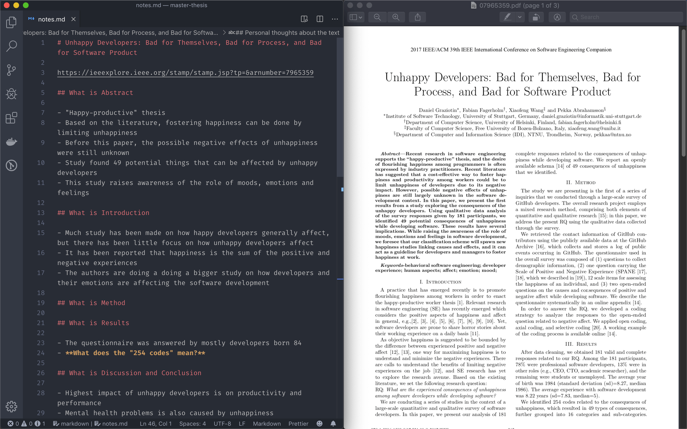

*Reading is easy, but* **reading and understanding at the same time** *is difficult and takes time.*

---

**Briefly**, the way I do it is by systematically reading one section after another, while writing down things in my own words. I constantly ask myself the question *"What does this mean?"*, and then I try to explain it to myself by writing my own explanation down. This way I force myself to understand the topic and I am not able to continue reading before I've tried to understand what I've just read.

---

During my computer science degree studies at University of Vaasa and Aalto University I have read probably hundreds of scientific articles and papers. Scientific articles are often very dense with information, have difficult structure of sentences, and use hard to understand fancy wording (i.e. they are boring to read!). I have created my own special way of reading and absorbing the information found from articles that are difficult to digest.

*A screenshot of my desktop when I'm reading and understanding an article*

I use the following steps when reading:

1. I open the article on my right half side of my desktop, and a notepad on the left side of the desktop
2. I write down the title of the paper, and where I can find it when I need to find it again in the future
3. By scrolling through the article I see all the sections of the paper and write them down like *"What is Abstract, What is Discussion and Conclusions etc."*.
4. I add two important things to my notes: **"Interpretations from the text"** and **"Personal thoughts about the text"**
5. Finally, I read through the sections so that I first read the abstract, then the conclusions, then the introduction. In other words, if the paper consists of sections 1-6, I first read section 1, then 6, then 2, then 5 and so on. 

**Step 4.** is quite important, and needs a bit more explanation. While reading an article or paper it is important to both differentiate the author's opinions/statements from the sources they are citing, but also to differentiate your own thoughts and interpretations from them. This is why I also have to do that in my notes very specifically. All notes I write under the sections are statements that I could directly move and use in my own paper. However, the things that come under "Interpretations" and "Personal thoughts" are things that help myself to create an opinion on the message the paper is telling.

I've found that these steps help me concentrate tremendously and allows me to really understand the things that I am reading.
